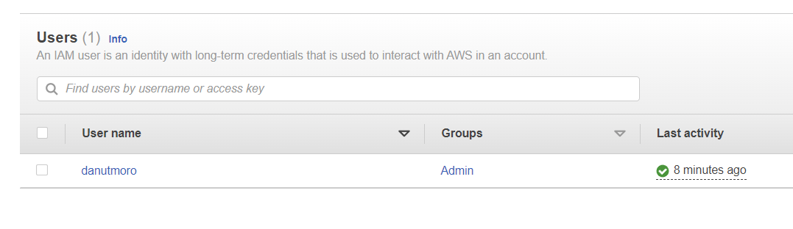
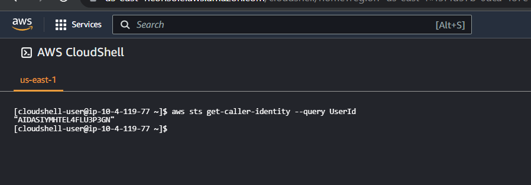
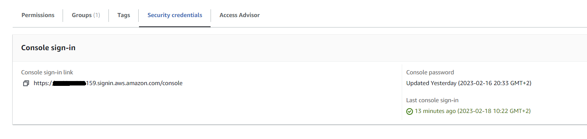
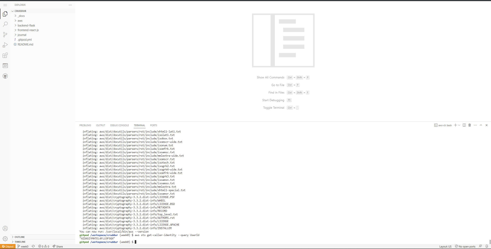
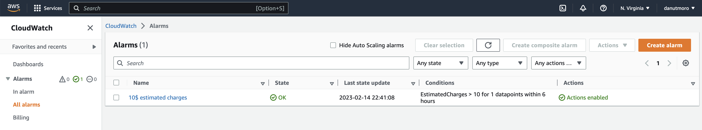
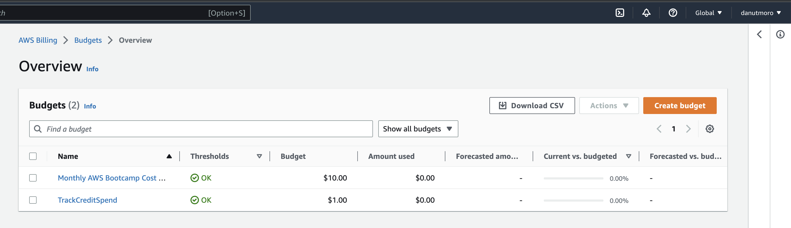

# Week 0 — Billing and Architecture

## Homework

- [Recreate Conceptual Diagram in Lucid Charts or on a Napkin](https://lucid.app/lucidchart/719a4347-86e4-4d16-a130-11278ee13262/view)
- [Recreate Logical Architectual Diagram in Lucid Charts](https://lucid.app/documents/view/beb5587b-1f0a-40b5-ae94-c52da8256579)
- Create an admin user

- Use CloudShell

- Generate AWS Credentials

- Installed AWS CLI

- Create a Billing Alarm

  - [alarm_config.json](../aws/json/alarm_config.json)
- Create a budget

  - [budget.json](../aws/json/budget.json "Budget")
  - [budget-notifications.json](../aws/json/budget-notifications.json "Budget notifications")
